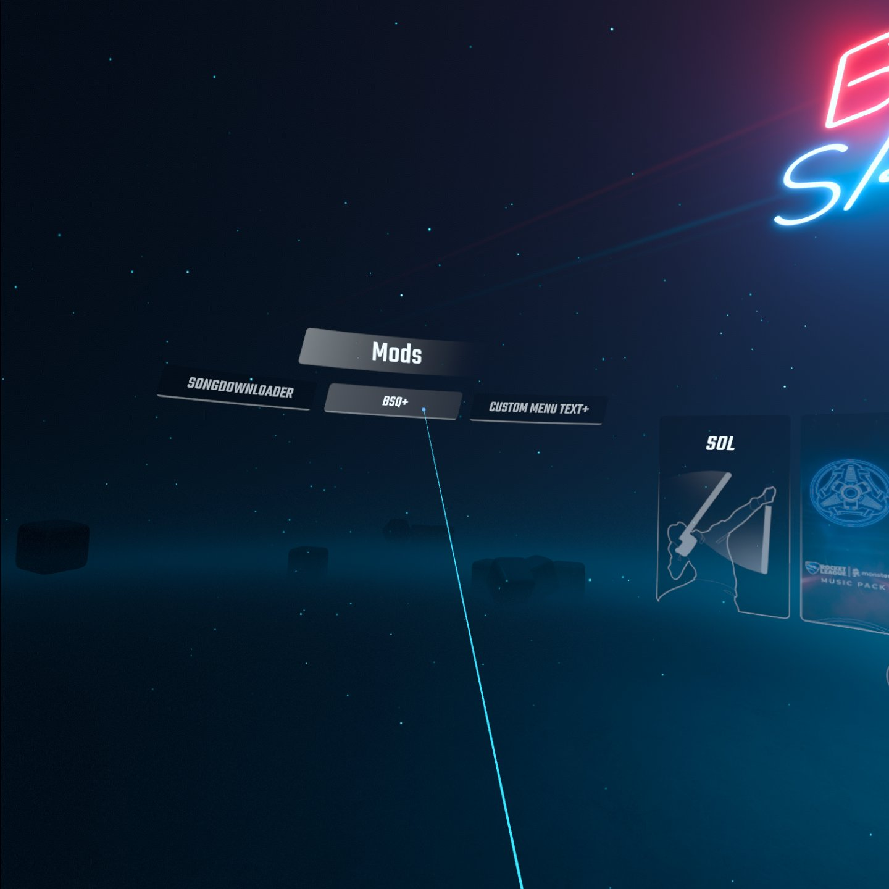
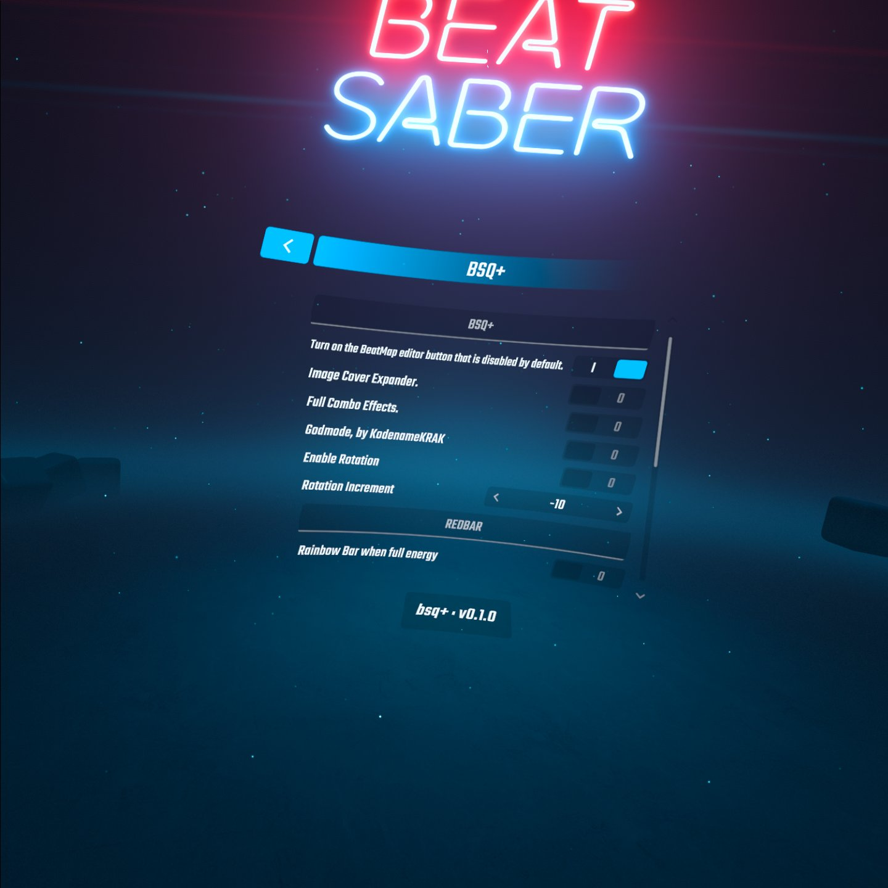
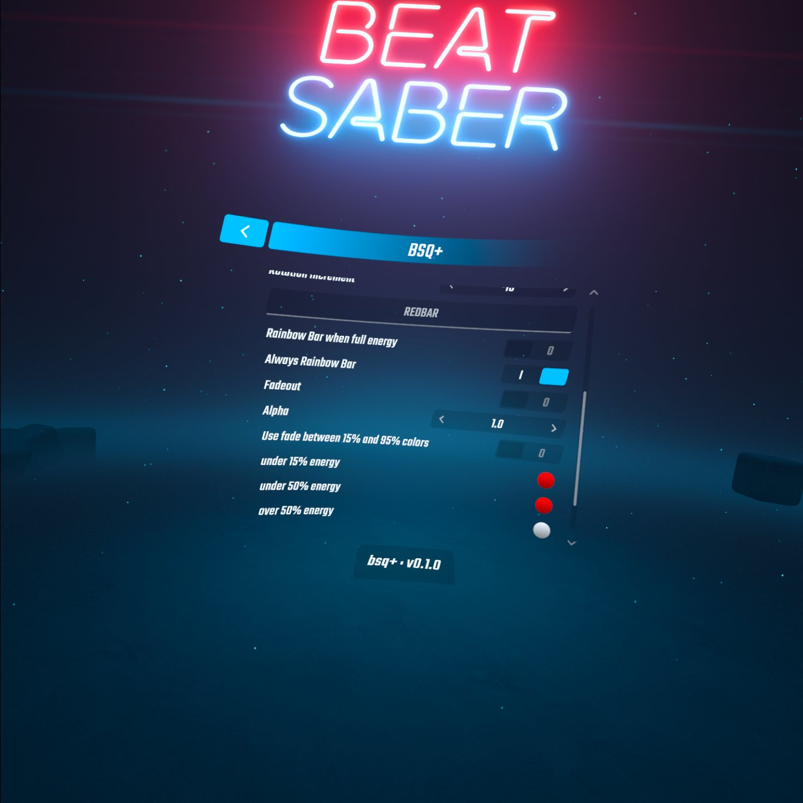

# BSQ+

# Features
- Enable BeatMapEditor button in the main menu.
- Installs both modded multiplayer mods, MultiPlayerCore and BeatTogether automatically.
- Enable Image Cover Expander.
- Enable SearchFixes.
- Enable Full Combo Effects.
- GodMode-by [KodenameKRAK](https://github.com/kodenamekrak)
    - Essentially makes your energy infinite, meaning that you can pass literally any level and still have your play and score uploaded to BeatLeader. 
    - **NOTE:** Accuracy is not affected, you still need to make an effort to get a *good* score.
- World Rotation
    - Shifts map's spawn points to the right or left while playing a song, even directly behind you!

**Also includes: RedBar by [ComputerElite](https://github.com/ComputerElite)**

## Credits

* [zoller27osu](https://github.com/zoller27osu), [Sc2ad](https://github.com/Sc2ad) and [jakibaki](https://github.com/jakibaki) - [beatsaber-hook](https://github.com/sc2ad/beatsaber-hook)
* [raftario](https://github.com/raftario)
* [Lauriethefish](https://github.com/Lauriethefish), [danrouse](https://github.com/danrouse) and [Bobby Shmurner](https://github.com/BobbyShmurner) for [this template](https://github.com/Lauriethefish/quest-mod-template)
